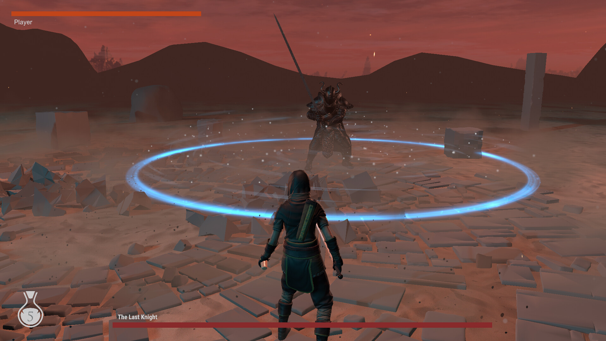

# Souls-Combat
 

A Unity project made for study purpose. 

All assets used on this project are free to use, except the sounds and musics that are from Dark Souls 1 game.

Youtube video: https://youtu.be/uiCM7raXgs0

You can download the game from this link: https://drive.google.com/file/d/18ZAc...​

I can't say if the game works fine with a Playstation controller, I only tested with a Xbox one. Keyboard and mouse works fine.

There are optimization options in the menu, if you don't have a video card.

This game is ultra-wide screen compatible.
